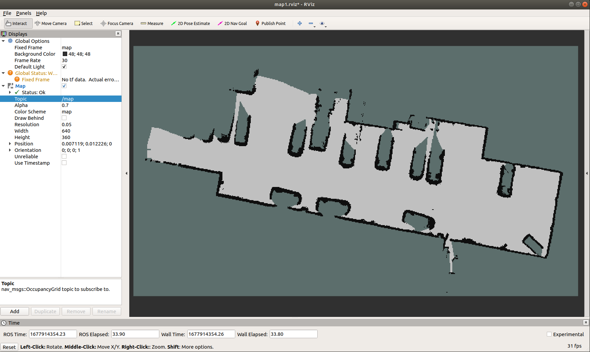
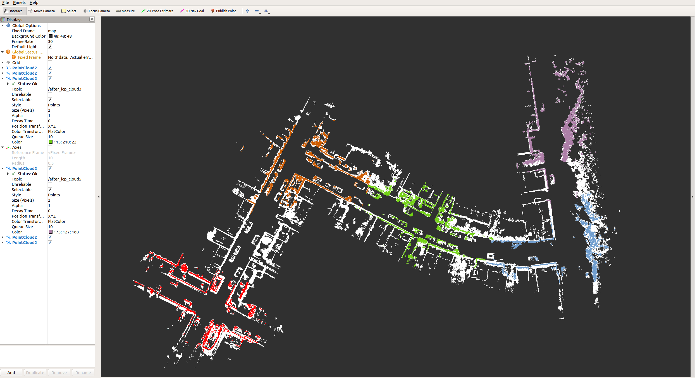
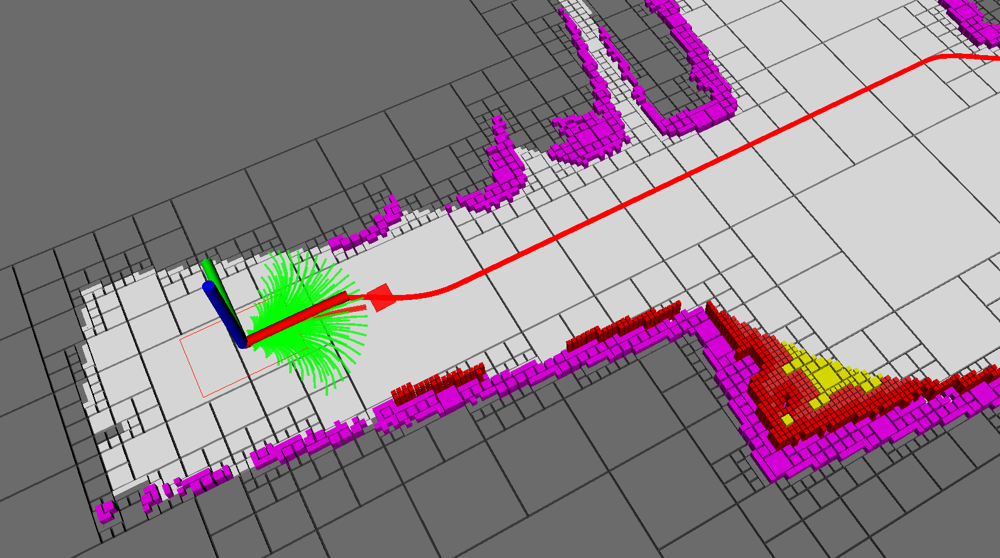

<p align="center">
  <h1 align="center"> A Non-Uniform Quadtree Map Building Method Including Dead-End Semantics Extraction </h1>
  <p align="center">
    <a <strong>Xiuzhong Hu</strong></a>
    ·
    <a <strong>Guangming Xiong</strong></a>
    ·
    <a <strong>Junyi Ma</strong></a>    
    ·    
    <a <strong>Gege Cui</strong></a>
    ·
    <a <strong>Quanfu Yu</strong></a>
    ·
    <a <strong>Shihao Li</strong></a>        
    ·
    <a <strong>Zijie Zhou</strong></a>           
  </p>
  <p align="center"><strong>Beijing Institute of Technology</strong></a>
  </h3>
  <div align="center"></div>
</p>
Our work has been accepted by Green Energy and Intelligent Transportation. [paper link](https://www.sciencedirect.com/science/article/pii/S2773153723000075)

## 0. Dependency & Install
### Dependency
Our program was tested on ubuntu 18.04, ros-melodic. Related packages are: pcl-1.8, eigen3, opencv, Ceres, etc.

### Install
```bash
cd xxx/Non-uniform_quadtree_map_master
catkin_make # or catkin_make -jn，n is the number of cores in the computer's cpu.
```
## 1. Non-uniform quadtree map building including dead-end_semantic_information_extraction
To improve the application transferability, we adapt the application input to the common `ROS` topic `nav_msgs/OccupancyGrid` i.e. grid map. A sample grid map is shown below.
<div align=center></div>

### 1.1 Non-uniform quadtree map building
Publish 2D raster maps, and convert 2D maps to non-uniform quadtree maps.
```bash
cd xxx/Non-uniform_quadtree_map_master
source ./devel/setup.bash
roslaunch ./launch/non-uniform_quadtree_map.launch
```
<div align=center></div>

### 1.2 Non-uniform quadtree map building including dead-end_semantic_information_extraction
Publish 2D grid map; Extract dead end semantic information from 2D grid map, and convert grid map to 2D dead end semantic map on this basis; Convert 2D map to non-uniform quadtree map.
```bash
cd xxx/Non-uniform_quadtree_map_master
source ./devel/setup.bash
roslaunch ./launch/non-uniform_quadtree_map_with_dead-end_semantics.launch
```
<div align=center></div>

## 2. map matching on non-uniform quadtree map
```bash
cd xxx/Non-uniform_quadtree_map_master
source ./devel/setup.bash
roslaunch ./launch/map_match_quadtree_kitti.launch
```
The map matching effect is shown below, where white is the point cloud corresponding to the offline map and the other colors are the point clouds corresponding to the online map.
<div align=center></div>

## 3. Global and local path planning
### 3.1 Publish map
```bash
cd xxx/Non-uniform_quadtree_map_master
source ./devel/setup.bash
roslaunch ./launch/non-uniform_quadtree_map_with_dead-end_semantics.launch
```
<div align=center></div>

### 3.2 Receive map topics and run planning programs
**Planning related code involves other work, so no details will be released for now.**
After receiving the map topic and setting the start and end points, global planning based on A-star algorithm and local path planning based on DWA are initiated. The planning result is as follows.
<div align=center></div>
The zoomed-in effect on the left side is shown below.
<div align=center></div>


