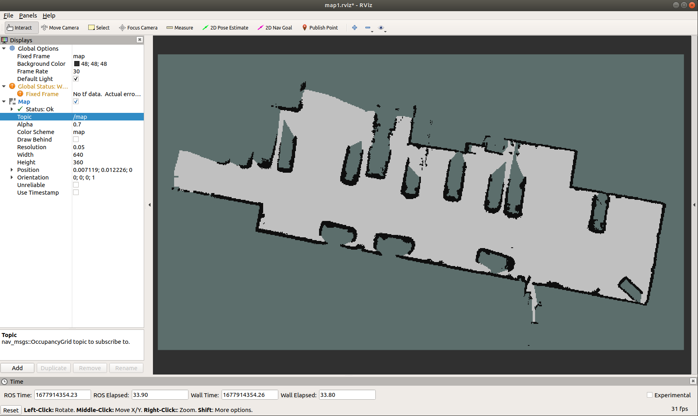
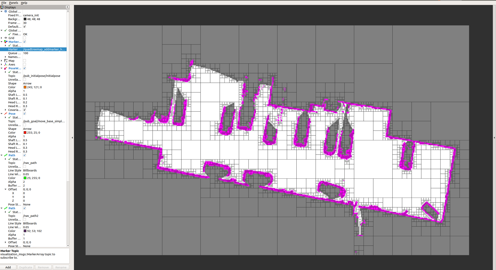
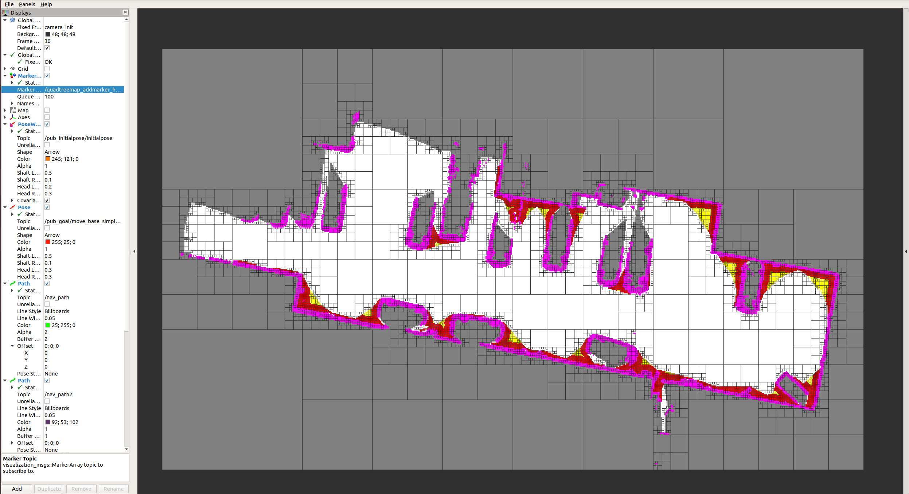
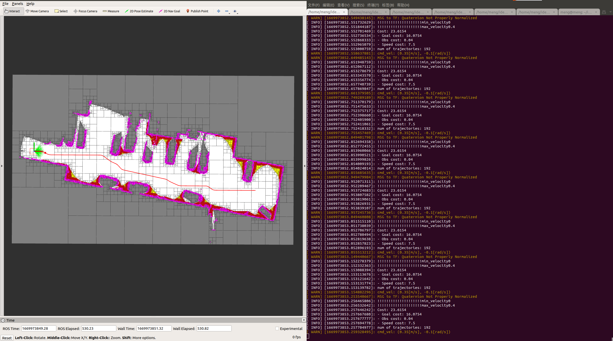
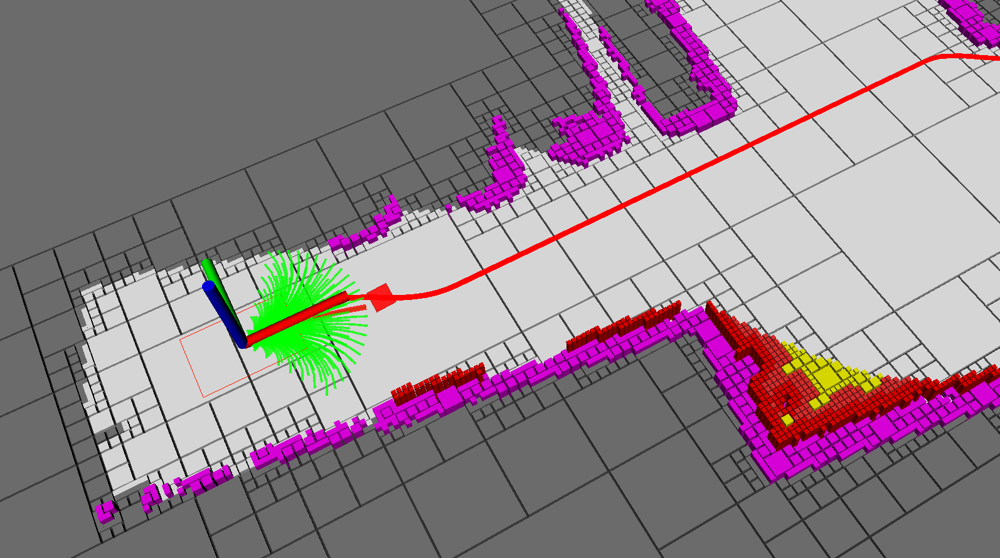

<p align="center">
  <h1 align="center"> A Non-Uniform Quadtree Map Building Method Including Dead-End Semantics Extraction </h1>
  <p align="center">
    <a <strong>Xiuzhong Hu</strong></a>
    ·
    <a <strong>Guangming Xiong</strong></a>
    ·
    <a <strong>Junyi Ma</strong></a>    
    ·    
    <a <strong>Gege Cui</strong></a>
    ·
    <a <strong>Quanfu Yu</strong></a>
    ·
    <a <strong>Shihao Li</strong></a>        
    ·
    <a <strong>Zijie Zhou</strong></a>           
  </p>
  <p align="center"><strong>Beijing Institute of Technology</strong></a>
  </h3>
  <div align="center"></div>
</p>
我们的工作已经录用，还未出版

## 0. Dependency & Install
### Dependency
我们的程序在ubuntu18.04、ros-melodic上进行测试，相关软件包有：pcl-1.8、eigen3、opencv、Ceres等

### Install
```bash
cd xxx/Non-uniform_quadtree_map_master
catkin_make # 或 catkin_make -jn，n是计算机cpu的内核数
```
## 1. Non-uniform quadtree map building including dead-end_semantic_information_extraction
(包括死角语义信息提取的非均匀四叉树地图)
为了提高程序的可移植性，我们将程序输入调整为常用的`ROS`话题`nav_msgs/OccupancyGrid`即栅格地图，栅格地图示例如下所示。
<div align=center></div>

### 1.1 Non-uniform quadtree map building
发布2D栅格地图, 将2D地图转换为非均匀四叉树地图
```bash
cd xxx/Non-uniform_quadtree_map_master
source ./devel/setup.bash
roslaunch ./launch/non-uniform_quadtree_map.launch
```
<div align=center></div>

### 1.2 Non-uniform quadtree map building including dead-end_semantic_information_extraction
发布2D栅格地图，从2D栅格地图中提取死角语义信息，在此基础上将栅格地图转换为2D死角语义地图; 将2D地图转换为非均匀四叉树地图
```bash
cd xxx/Non-uniform_quadtree_map_master
source ./devel/setup.bash
roslaunch ./launch/non-uniform_quadtree_map_with_dead-end_semantics.launch
```
<div align=center></div>

## 2. map matching on non-uniform quadtree map
(基于非均匀四叉树地图的地图匹配)
```bash
cd xxx/Non-uniform_quadtree_map_master
source ./devel/setup.bash
roslaunch ./launch/map_match_quadtree_kitti.launch
```
地图匹配效果为（彩色为在线地图对应的点云，白色为离线地图对应的点云）：
<div align=center></div>

## 3. Global and local path planning
(全局和局部路径规划)
### 3.1 发布地图
发布2D栅格地图，从2D栅格地图中提取死角语义信息，在此基础上将栅格地图转换为2D死角语义地图; 将2D地图转换为非均匀四叉树地图
```bash
cd xxx/Non-uniform_quadtree_map_master
source ./devel/setup.bash
roslaunch ./launch/non-uniform_quadtree_map_with_dead-end_semantics.launch
```
<div align=center></div>

### 3.2 接收地图话题运行规划程序
**规划相关代码涉及到其他工作，暂时不发布细节**

接收地图话题，启动基于A-star算法的全局规划和基于dwa的局部路径规划，并设置起点和终点。效果如下：
<div align=center></div>
左侧放大效果如下
<div align=center></div>


